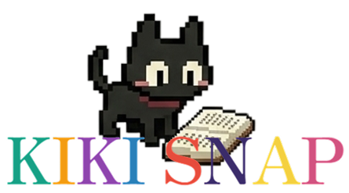

  

# Kiki Snap (リリース配布用 / Release Distribution)

**PDF化/画像化でつまずいた人の最終到達点。**

**The ultimate solution for those struggling with PDF/image conversion.**

画面を自動的にスクリーンショットし、ページをめくりながら連続でキャプチャ、最終的にPDF化までをサポートする汎用的なツールです。各種ビューアーアプリケーションでの資料記録を目的としています。    

This is a versatile tool that automatically takes screenshots of your screen, captures pages continuously while turning them, and supports PDF conversion. It is designed for recording materials in various viewer applications.                                                                                                                                                             
本リポジトリは、KikiSnapの実行環境をまとめた **インストーラー版配布用のリポジトリ** です。

This repository is for distributing the installer version of KikiSnap with a complete runtime environment.

---

## 概要 / Overview

Python環境の構築やコマンド操作は不要です。同封されている『`KikiSnap_Installer.exe`』をダウンロードして実行するだけで、どなたでも簡単にインストール・ご利用いただけます。

No Python environment setup or command-line operations required. Simply download and run the included `KikiSnap_Installer.exe` to easily install and use the application.

---

## アプリの主な特長 / Key Features

- **マウスで簡単範囲指定**: 実行時にマウスドラッグでキャプチャしたい範囲を視覚的に選択できます。
  - **Easy Mouse Selection**: Visually select the capture area by dragging with your mouse at runtime.

- **高DPI完全対応**: Windowsの表示スケール設定（125%や150%など）の影響を受けず、正確にキャプチャします。
  - **Full High-DPI Support**: Captures accurately regardless of Windows display scaling settings (125%, 150%, etc.).

- **賢い制御機能**: 対象が最前面にない場合の警告・一時停機能や、末尾到達時の自動終了機能を搭載しています。
  - **Smart Control Features**: Includes warning/pause functionality when the target is not in the foreground, and automatic termination when reaching the end.

- **カンタンPDF変換**: 取得したスクリーンショット群を、画質を選んで1つのPDFに簡単にまとめられます。
  - **Easy PDF Conversion**: Easily combine captured screenshots into a single PDF with selectable quality options.

---

## ⚠️ 免責事項（重要） / Disclaimer (Important)

**本ツールは私的利用の範囲内で、かつ対象アプリケーションやサービスの利用規約に違反しない用途でのみ使用してください。**

**This tool should only be used within the scope of private use and in a manner that does not violate the terms of service of the target application or service.**

- 本ソフトウェアの利用により生じた、いかなる直接的・間接的な損害（アカウント停止・凍結、法的措置、データ損失、金銭的損害、信用毀損等を含むがこれに限らない）について、開発者は一切の責任を負いません。
- 各プラットフォームの利用規約や関連法令（著作権法等）を遵守する義務があり、本ソフトウェアを利用する上での全ての法的責任はユーザー自身に帰属します。
- 本ツールの使用により、利用しているサービスからアカウント停止や法的措置を受けた場合でも、開発者は一切関与せず、責任を負いません。
- 自動化ツールの使用を明示的に禁止しているサービスでの利用は、規約違反となる可能性が高いため、必ず事前に各サービスの利用規約を確認してください。
- 本ツールを使用した時点で、上記の免責事項に同意したものとみなします。

---

- The developer assumes no responsibility whatsoever for any direct or indirect damages (including but not limited to account suspension/termination, legal action, data loss, financial damages, reputational harm, etc.) arising from the use of this software.
- You have an obligation to comply with the terms of use of each platform and related laws (Copyright Act, etc.), and all legal responsibility for using this software belongs to the user.
- Even if you receive account suspension or legal action from the service you are using as a result of using this tool, the developer will not be involved in any way and assumes no responsibility.
- Use in services that explicitly prohibit the use of automation tools is highly likely to violate the terms of service, so be sure to check the terms of service of each service in advance.
- By using this software, you are deemed to have agreed to all of the above terms of use and disclaimers.
